# Разбор задания «Капибокс»

**Сложность:** простое \
**Направления:** Web, Misc, Reverse \
**Автор:** [Дмитрий Татаров](https://t.me/kukuxumushi) (SPbCTF)

## Условие задачи

Известный боксёр получил нокаут в последнем бою, после чего забыл, где хранится его пароль от криптокошелька. А курс капикоина сегодня взлетел! Выудите пароль из глубин его бессознательного, чтобы боксёр смог выгодно продать свои коины и утешиться после поражения.

Реалтайм-МРТ: [t-boxing-i7g5wg26.spbctf.org/](t-boxing-i7g5wg26.spbctf.org/)

## Шаг 1: Изучение внутренних файлов ресурса «Реалтайм-МРТ».

Из условия задачи мы знаем, что боксёру требуется вспомнить сид-фразу от криптокошелька. Посмотреть поле для ввода фразы можно с помощью одноимённой кнопки в правом нижнем углу. Нужная нам фраза хранится где-то внутри головного мозга, который мы можем заметить на экране МРТ, однако даже максимальное приближение не даёт нам должного результата. 

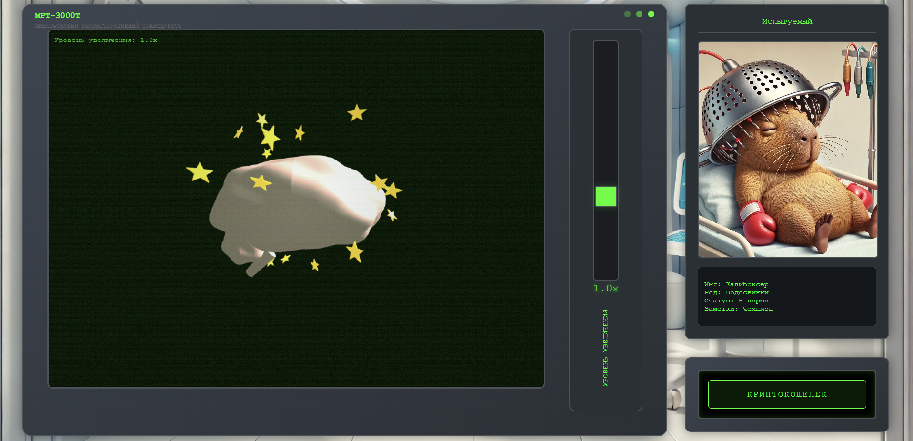

\
Для того, чтобы понять как работает сайт, необходимо изучить файлы с форматом `.js`. Нажмём на кнопку *F12*, перейдём в панель разработчика и выберем вкладку *«Sources»*. 

В папке *static* находится другая папка - *js* и внутри неё таких файлов всего 3: `brain_fog.js`, `brain_model.js`, `mri_interface.js`.

Первый файл (`brain_fog.js`) представляет собой что-то похожее на зашифрованный qr-код, но в данном случае его разбирать необязательно.

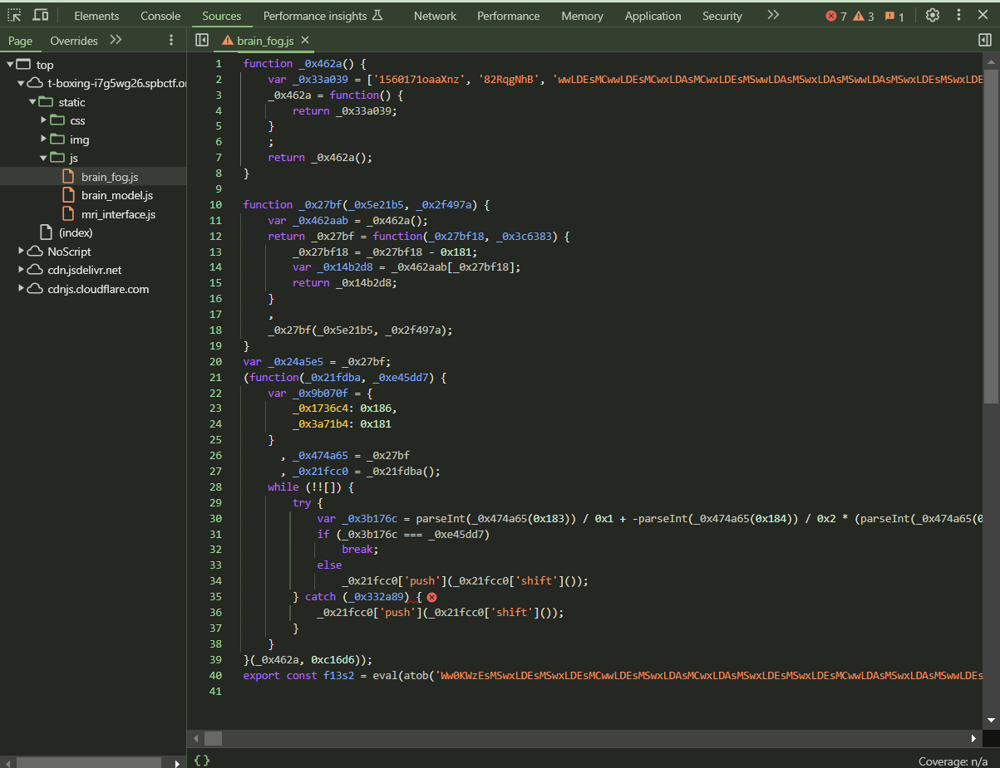

\
Второй файл (`brain_model.js`) представляет собой основную логику формирования модели головного мозга. При подробном чтении кода можно понять как формируются фигуры, которые вероятно всего находятся за внешней оболочкой модели.

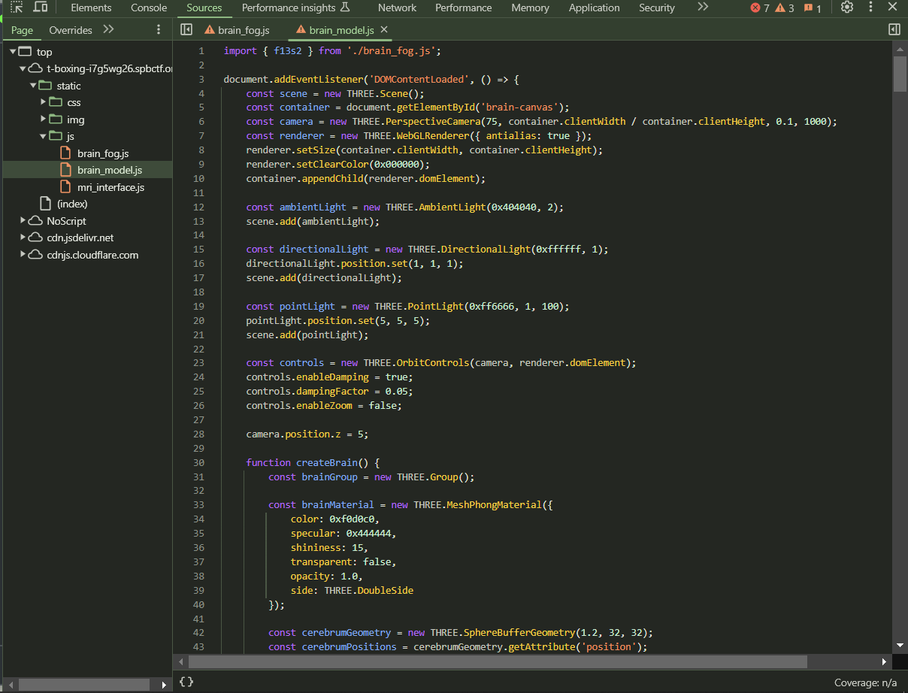

\
Третий файл (`mri_interface.js`) представляет собой логику построения окошка МРТ, которое служит контейнером для модели головного мозга.

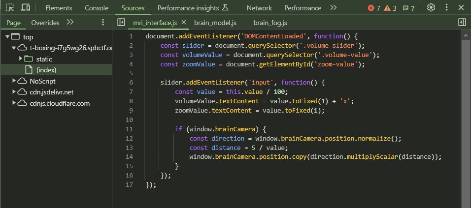

## Шаг 2: Настройка функции Override.

После того, как мы посмотрели все внутренние файлы ресурса, необходимо настроить *Override*, в котором мы будем редактировать код. Данная функция позволяет вносить изменения в веб-страницы и сохранять их даже после перезагрузки.

Если её нет на второстепенной панели рядом со вкладкой *«Page»*, то её нужно открыть из дополнительного меню *(>>)*. 

Далее необходимо создать в любом удобном месте пустую папку. Затем нажимаем на кнопку *«Select folder for overrides»* и выбираем её в качестве хостовой папки для оверрайда.

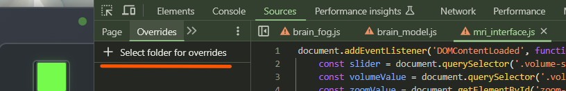

\
У меня эта папка будет находиться на рабочем столе, поэтому после её выбора нужно обязательно разрешить браузеру полный доступ к ней.

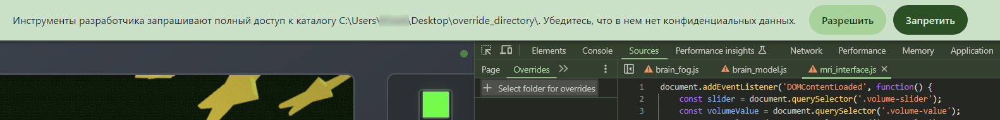

\
После того, как она появилась у нас во вкладке *«Overrides»*, перенесём туда файлы для их редактирования. Для этого нужно нажать на правую кнопку мыши и выбрать *«Override content»*. Так нужно сделать с двумя файлами - `brain_model.js` и `mri_interface.js`.

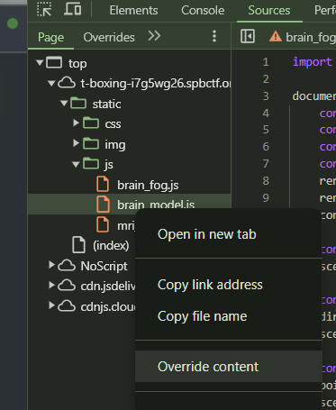

\
После переноса они появятся в ранее созданной папке для оверрайда. Теперь их можно редактировать с возможностью сохранения изменений.

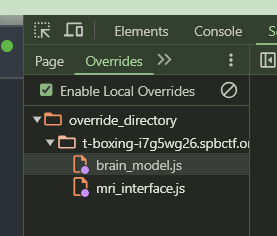

## Шаг 3: Редактирование и перезапись файлов ресурса «Реалтайм-МРТ».

Теперь, когда у нас есть файлы для оверрайда, мы можем их изменять. Первым рассмотрим файл `mri_interface.js`. При прочтении кода можно заметить значение *value*, которое используется для определения зума и позиционирования модели в пространстве. Опытным путём подберём значение, на которое будет делиться переменная *value*. Оно подбирается таким образом, чтобы можно было рассмотреть все детали внутри головного мозга.

\
***Обратите внимание!*** \
После того, как мы внесли изменения в файл, его нужно обязательно сохранить *(Ctrl + S)* и после этого обновить всю страницу *(F5)*.

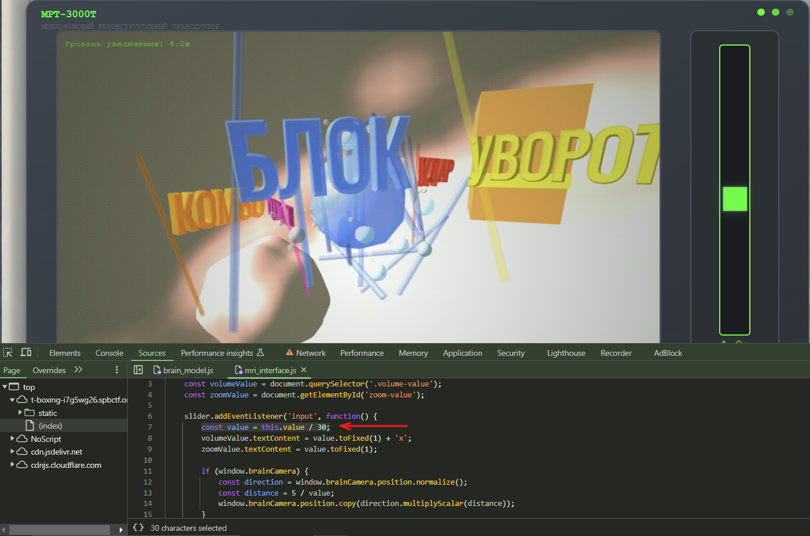

\
При просмотре всех деталей, заметим, что в сундуке есть скрытый QR-код. Закрыт он чем-то, похожим на скомканные листы бумаги. 

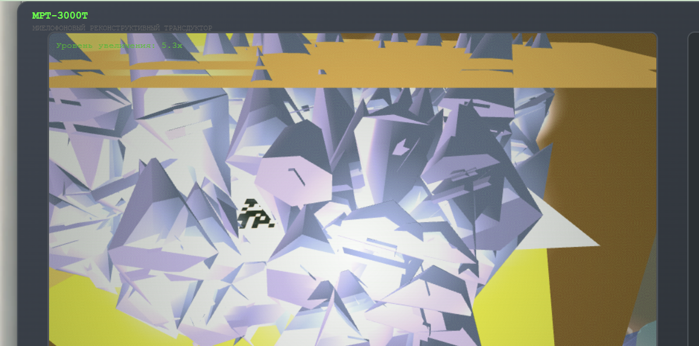

\
Далее перейдём к файлу `brain_model.js` и прочитаем код более подробно. Нас интересуют элементы, которые связаны с бумагой, находящейся внутри сундука. Удалим кусок кода, который отвечает за генерацию бумаги, сохраним его аналогично прошлому файлу и перезагрузим сайт. 

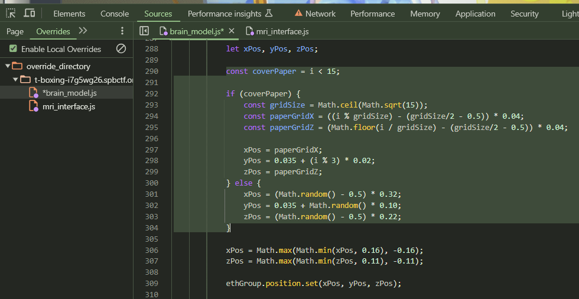

\
В итоге получаем наш заветный QR-код и остаётся только поймать его в удачный момент, чтобы отсканировать. Можно заснять видео и затем найти наиболее удачные кадры. Либо с помощью *Shift* и танцев с бубном ловить удачный момент в лайф-режиме.

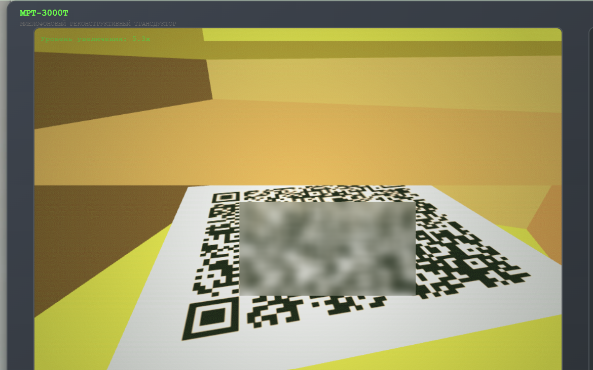

\
Отсканировав QR-код, мы получим сид-фразу. Вставив её в окошко криптокошелька, мы получим к нему доступ и заветный флаг.

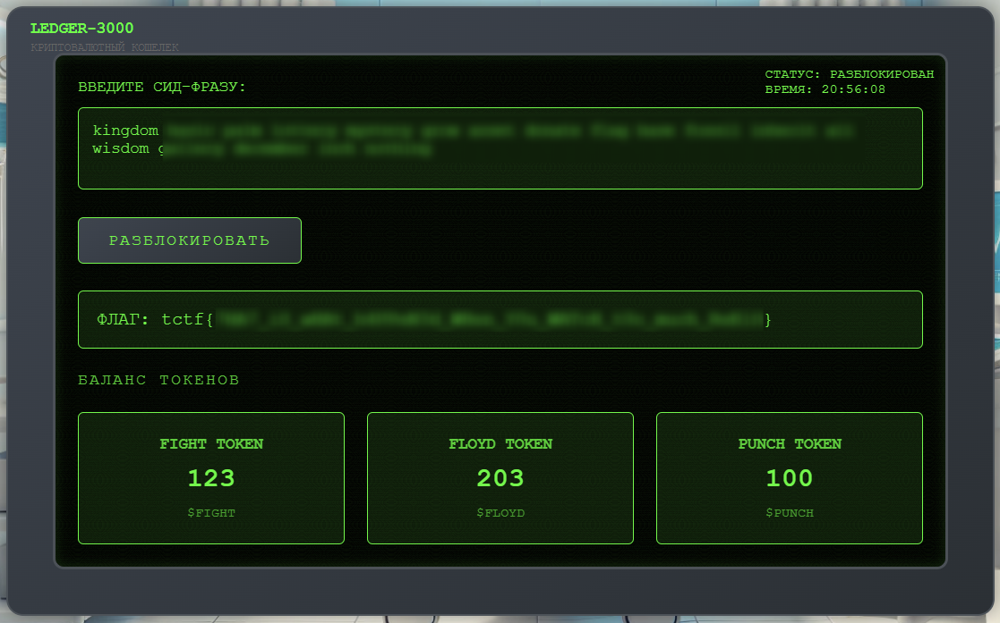

